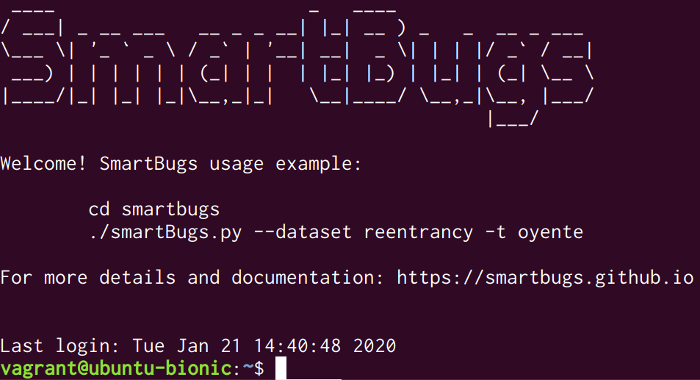

# SmartBugs Vagrant Box

This Vagrant box can be used to experiment with SmartBugs.




## Requirements

We tested this Vagrant box with [Vagrant](https://www.vagrantup.com) 2.2.6 and [VirtualBox](https://www.virtualbox.org) 5.2.34

The Vagrant plugin `vagrant-reload` is required and can be installed as:

```bash
vagrant plugin install vagrant-reload
```

## Usage

Just run the following command to get the virtual box up and running:

```bash
vagrant up
```

To access the box, use the command:

```bash
vagrant ssh
```

For more details and documentation on SmartBugs: https://smartbugs.github.io
